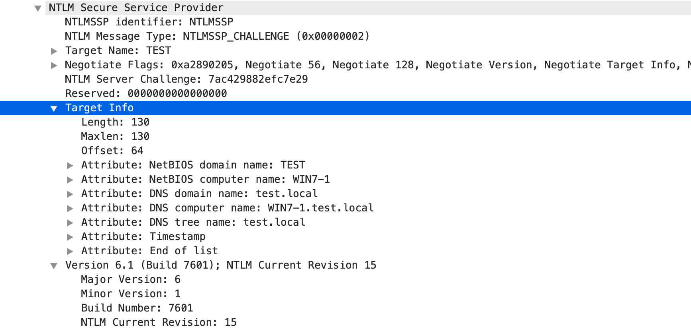
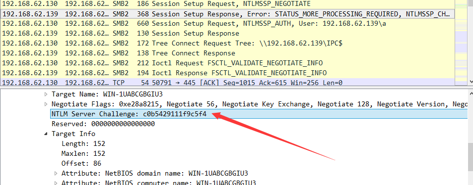
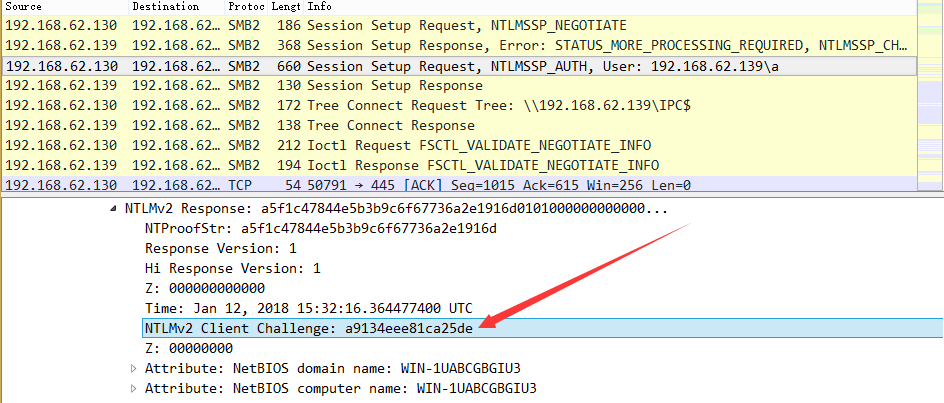

[toc]

NTLM的东西在github之前写过，但是不够详细，这里重新再过一遍。

NTLM使用在Windows的工作组环境中，而kerberos则使用在域的情况下。

# LM hash & NTLM hash

在写NTLM认证之前先写下LM和NTLM。

hash密码格式：

```
Administrator:500:AAD3B435B51404EEAAD3B435B51404EE:31D6CFE0D16AE931B73C59D7E0C089C0:::
用户名:SID:LM-Hash:NTML-Hash:::
```

## LM Hash

全称LAN Manager Hash, windows最早使用的加密算法。

LM Hash计算步骤：

1.  密码全部转换为大写，转换为16进制，14字节，不足用0补全。
2.  分成两个7字节，每部分为56bit
3.  每7bit分组，在后面加一个0bit，即每组8bit
4.  上述两组，使用DES分别加密，key为：`KGS!@#$%`
5.  完成后，两组拼接，得到LM Hash

代码实现：

```python
#coding=utf-8
import re
import binascii
from pyDes import *
def DesEncrypt(str, Des_Key):
    k = des(binascii.a2b_hex(Des_Key), ECB, pad=None)
    EncryptStr = k.encrypt(str)
    return binascii.b2a_hex(EncryptStr)

def group_just(length,text):
    # text 00110001001100100011001100110100001101010011011000000000
    text_area = re.findall(r'.{%d}' % int(length), text) # ['0011000', '1001100', '1000110', '0110011', '0100001', '1010100', '1101100', '0000000']
    text_area_padding = [i + '0' for i in text_area] #['00110000', '10011000', '10001100', '01100110', '01000010', '10101000', '11011000', '00000000']
    hex_str = ''.join(text_area_padding) # 0011000010011000100011000110011001000010101010001101100000000000
    hex_int = hex(int(hex_str, 2))[2:].rstrip("L") #30988c6642a8d800
    if hex_int == '0':
        hex_int = '0000000000000000'
    return hex_int

def lm_hash(password):
    # 1. 用户的密码转换为大写，密码转换为16进制字符串，不足14字节将会用0来再后面补全。
    pass_hex = password.upper().encode("hex").ljust(28,'0') #3132333435360000000000000000
    print(pass_hex) 
    # 2. 密码的16进制字符串被分成两个7byte部分。每部分转换成比特流，并且长度位56bit，长度不足使用0在左边补齐长度
    left_str = pass_hex[:14] #31323334353600
    right_str = pass_hex[14:] #00000000000000
    left_stream = bin(int(left_str, 16)).lstrip('0b').rjust(56, '0') # 00110001001100100011001100110100001101010011011000000000
    right_stream = bin(int(right_str, 16)).lstrip('0b').rjust(56, '0') # 00000000000000000000000000000000000000000000000000000000
    # 3. 再分7bit为一组,每组末尾加0，再组成一组
    left_stream = group_just(7,left_stream) # 30988c6642a8d800
    right_stream = group_just(7,right_stream) # 0000000000000000
    # 4. 上步骤得到的二组，分别作为key 为 "KGS!@#$%"进行DES加密。
    left_lm = DesEncrypt('KGS!@#$%',left_stream) #44efce164ab921ca
    right_lm = DesEncrypt('KGS!@#$%',right_stream) # aad3b435b51404ee
    # 5. 将加密后的两组拼接在一起，得到最终LM HASH值。
    return left_lm + right_lm

if __name__ == '__main__':
    hash = lm_hash("aaaaa")
```

上述LM Hash有一些问题：

1.  密码长度不超过14字节
2.  不区分大小写
3.  长度小于7位的话，后半部分唯一确定:`aad3b435b51404ee`
4.  14字节转化为2*7，降低了复杂度，即7字节DES的2倍
5.  DES强度低
6.  key固定

## NTLM Hash

为解决上述问题，微软在1993年的Windows NT 3.1引入NTLM Hash，下面为各Windows对LM和NTLM的支持：

|      | 2000 | XP   | 2003 | Vista | Win7 | 2008 | Win8 | 2012 |
| ---- | ---- | ---- | ---- | ----- | ---- | ---- | ---- | ---- |
| LM   | √    | √    | √    |       |      |      |      |      |
| NTLM | √    | √    | √    | √     | √    | √    | √    | √    |

其中，在Win 2000/XP/2003中，长度不超过14的话，依旧使用LM，超过的话使用NTLM。

在Vista开始，默认只存储NTLM Hash，不存LM Hash(LM Hash固定`AAD3B435B51404EEAAD3B435B51404EE`，NULL之后运算的结果)，有些工具的格式固定，需要填写LM Hash，0填充即可。LM Hash的位置依旧存在，只不过没有价值。

NTLM Hash计算步骤：

1.  转16进制
2.  Unicode编码，就是加00
3.  使用MD4对Unicode进行hash

```python
python -c 'import hashlib,binascii; print binascii.hexlify(hashlib.new("md4", "p@Assword!123".encode("utf-16le")).digest())'
```


# NTLM身份认证

分为本地认证和网络认证

## 本地认证


Windows在保存密码的时候，保存的不是密码的明文，而是密码的hash。

保存的位置：`%SystemRoot%\system32\config\sam`

SAM文件中保留了计算机本地所有用户的凭证信息，可以理解为是一个数据库


当登陆的时候，系统读SAM文件中内容与输入的比较，相同则认证成功。

认证流程：`winlogon.exe --> 用户输入 --> lsass.exe（认证）`

用户注销、重启、锁屏后，系统会让`winlogon.exe`显示登陆界面，之后用户输入，得到输入后交给lsass进程，将明文加密为NTLM后，与SAM中的内容进行比较。

lsass：用于微软Windows系统的安全机制，用于本地安全和登陆策略。

## 网络认证

上面是本地认证，下面这里来写网络认证。

NTLM是一种网络认证协议，它是基于挑战（Challenge）/响应（Response）认证机制的一种认证模式。这个协议只支持Windows。

由三种消息组成，即三步：

1.  协商type1：协商确定协议版本，重要的是用户名
2.  质询type2：挑战/响应起作用的范畴，重要的是challenge，服务端生成
3.  身份验证type3：质询完成后的验证，重要的是response，客户端生成，又称为`Net NTLM Hash`，用户NTLM Hash计算challenge的结果

在工作组中完整流程：

1.  用户名/密码登陆客户端

2.  客户端将密码进行hash存储，丢弃密码明文。客户端发送协商消息type1(NEGOTIATE)，包含客户端支持和服务端请求的功能列表，请求还包含用户名、机器以及需要使用的安全服务等信息。

3.  服务端使用type2(质询)消息进行响应，包含服务端支持和同意的功能列表。其中最重要的是服务端生成的challenge，即服务端随机生成的16位随机数。

4.  客户端收到上述响应后，发送type3(验证)消息。用户收到上述响应后，使用用户NTLM Hash加密challenge，得到response，发送的验证消息包含[response，username，challenge]。

    这里NTLM Hash计算challenge的结果在网络协议中成为`Net NTLM Hash`。

5.  服务端拿到type3(验证)消息后，服务端使用用户的NTLM Hash加密challenge，得到response1，将其与客户端发送的response进行比较验证。

上述是在工作组中的流程，下面是在域中的流程，前4步是一样的，只有最后一步不一样，分为两步：

5.  服务端拿到type3(验证)消息后，服务端使用用户的NTLM Hash(如果服务端有的话)加密challenge，得到response1，将其与客户端发送的response进行比较验证。如果服务端本地没有该用户NTLM Hash的话，也就计算不了response1，这时服务端使用netlogon协议联系域控，建立好安全通道后，将type1,type2,type3一起发送给域控(这个过程也叫作Pass Through Authentication认证流程)
6.  域控使用challenge和用户NTLM Hash计算并与response比较验证。

## 三个过程

### 协商type1

每个字段的含义见微软文档：https://docs.microsoft.com/en-us/openspecs/windows_protocols/ms-nlmp/b34032e5-3aae-4bc6-84c3-c6d80eadf7f2

| 字段               | 含义                                                         |
| :----------------- | :----------------------------------------------------------- |
| Signature          | 签名，一个 8 字节字符数组，必须包含 ASCII 字符串（'N'、'T'、'L'、'M'、'S'、'S'、'P'、'\0 '） |
| MessageType        | 消息类型，必须为0x00000001                                   |
| NegotiateFlags     | 包含一组**NEGOTIATE**结构                                    |
| DomainNameFields   | 包含域名信息字段。                                           |
| WorkstationFields  | 包含**WorkstationName**信息字段                              |
| Version            | 版本                                                         |
| Payload (variable) |                                                              |


### 质询type2

详细字段信息见微软文档：https://docs.microsoft.com/en-us/openspecs/windows_protocols/ms-nlmp/801a4681-8809-4be9-ab0d-61dcfe762786

质询的信息重要的就是服务端产生的challenge

| 字段               | 含义                                                         |
| ------------------ | ------------------------------------------------------------ |
| Signature          | 签名，同上                                                   |
| MessageType        | 消息类型，必须为0x00000002                                   |
| TargetNameFields   | 包含**TargetName**信息的字段                                 |
| NegotiateFlags     | 包含一组**NEGOTIATE**结构                                    |
| ServerChallenge    | 包含NTLM质询的8字节                                          |
| Reserved           | 一个 8 字节数组，其元素在发送时必须为零，并且在接收时必须被忽略。 |
| TargetInfoFields   | 包含**TargetInfo**信息的字段                                 |
| Version            | 版本                                                         |
| Payload (variable) |                                                              |

示例：



### 身份验证type3

详细字段信息见微软文档：https://docs.microsoft.com/en-us/openspecs/windows_protocols/ms-nlmp/033d32cc-88f9-4483-9bf2-b273055038ce

| 字段                            | 含义                                                         |
| ------------------------------- | ------------------------------------------------------------ |
| Signature                       | 签名，同上                                                   |
| MessageType                     | 消息类型，必须为0x00000003                                   |
| LmChallengeResponseFields       | 包含**LmChallengeResponse**信息的字段                        |
| NtChallengeResponseFields       | 包含**NtChallengeResponse**信息的字段                        |
| DomainNameFields                | 包含**DomainName**信息的字段                                 |
| UserNameFields                  | 包含**UserName** 信息的字段                                  |
| WorkstationFields               | 包含**Workstation**信息的字段                                |
| EncryptedRandomSessionKeyFields | 包含**EncryptedRandomSessionKey**信息的字段                  |
| NegotiateFlags                  |                                                              |
| Version                         |                                                              |
| MIC (16 bytes)                  | NTLM NEGOTIATE_MESSAGE、CHALLENGE_MESSAGE 和 AUTHENTICATE_MESSAGE 的消息完整性 |
| Payload (variable)              |                                                              |


# NTLM v1/v2协议

## NTLM与NTLM v1/v2与Net NTLM v1/v2区别

首先是NTLM，就是最上面的那个，例子：`AAD3B435B51404EEAAD3B435B51404EE:31D6CFE0D16AE931B73C59D7E0C089C0`

而`NTLM v1/v2`与NTLM不一样，`NTLM v1/v2`是`Net NTLM v1/v2`的缩写，也就是说他俩才是一回事。Net NTLM用于网络身份验证，就是上面那个challenge/response认证的那个，下面举个NTLM v2的例子，来源[hashcat](https://hashcat.net/wiki/doku.php?id=example_hashes)：

```
admin::N46iSNekpT:08ca45b7d7ea58ee:88dcbe4446168966a153a0064958dac6:5c7830315c7830310000000000000b45c67103d07d7b95acd12ffa11230e0000000052920b85f78d013c31cdb3b92f5d765c783030 
```


## NTLM v1/v2

NTLM v2是在Windows NT4.0 SP4中引入的，与NTLM v1的区别是challenge和hash算法不同，相同点是使用的都是NTLM Hash

-   challenge
    -   NTLM v1：8byte
    -   NTLM v2：16byte
-   Net NTLM Hash
    -   v1：DES
    -   v2：HMAC-MD5

NTLM  v1格式：

```
username::hostname:LM response:NTLM response:challenge
```

NTML v2格式：

```
username::domain:challenge:HMAC-MD5:blob
```

```
# NTLM

C = 8-byte server challenge, random
K1 | K2 | K3 = NTLM-Hash | 5-bytes-0
response = DES(K1,C) | DES(K2,C) | DES(K3,C)
```

```
# NTLM v2

SC = 8-byte server challenge, random
CC = 8-byte client challenge, random
CC* = (X, time, CC2, domain name)
v2-Hash = HMAC-MD5(NT-Hash, user name, domain name)
LMv2 = HMAC-MD5(v2-Hash, SC, CC)
NTv2 = HMAC-MD5(v2-Hash, SC, CC*)
response = LMv2 | CC | NTv2 | CC*
```

## Response提取NTLM v2

这里就不搭建了，使用的[3gstudent师傅](https://3gstudent.github.io/Windows%E4%B8%8B%E7%9A%84%E5%AF%86%E7%A0%81hash-NTLM-hash%E5%92%8CNet-NTLM-hash%E4%BB%8B%E7%BB%8D)

```
Server
	IP:192.168.62.139
	username:a
	password:test123
Client
	IP:192.168.62.130
```

客户端连接服务端：

`net use \\192.168.52.139 /u:a test123`

抓包：


前4个对应的就是NTLM认证的几个步骤，第二个查看数据包，其中的challenge：`c0b5429111f9c5f4`



查看第三个数据包得到客户端加密的challenge：

```
challenge:a9134eee81ca25de

response:a5f1c47844e5b3b9c6f67736a2e1916d:0101000000000000669dae86ba8bd301a9134eee81ca25de0000000002001e00570049004e002d003100550041004200430047004200470049005500330001001e00570049004e002d003100550041004200430047004200470049005500330004001e00570049004e002d003100550041004200430047004200470049005500330003001e00570049004e002d003100550041004200430047004200470049005500330007000800669dae86ba8bd30106000400020000000800300030000000000000000000000000300000e9d9e613613097d1e2f47c1fd97fa099f65dfd78075d8bdb5ca162492ea5d2990a001000000000000000000000000000000000000900260063006900660073002f003100390032002e003100360038002e00360032002e00310033003900000000000000000000000000
```



其中NTLM v2格式：

```
username::domain:challenge:HMAC-MD5:blob
```

-   domain可由数据包获得

-   HMAC-MD5对应数据包中的NTProofStr，见上图。
-   blob对应数据包中Response去掉NTProofStr的后半部分

完整NTLM v2的数据：

```
a::192.168.62.139:c0b5429111f9c5f4:a5f1c47844e5b3b9c6f67736a2e1916d:0101000000000000669dae86ba8bd301a9134eee81ca25de0000000002001e00570049004e002d003100550041004200430047004200470049005500330001001e00570049004e002d003100550041004200430047004200470049005500330004001e00570049004e002d003100550041004200430047004200470049005500330003001e00570049004e002d003100550041004200430047004200470049005500330007000800669dae86ba8bd30106000400020000000800300030000000000000000000000000300000e9d9e613613097d1e2f47c1fd97fa099f65dfd78075d8bdb5ca162492ea5d2990a001000000000000000000000000000000000000900260063006900660073002f003100390032002e003100360038002e00360032002e00310033003900000000000000000000000000
```

可以使用Hashcat对该Net-NTLM hash进行破解

```sh
hashcat -m 5600 a::192.168.62.139:c0b5429111f9c5f4:a5f1c47844e5b3b9c6f67736a2e1916d:0101000000000000669dae86ba8bd301a9134eee81ca25de0000000002001e00570049004e002d003100550041004200430047004200470049005500330001001e00570049004e002d003100550041004200430047004200470049005500330004001e00570049004e002d003100550041004200430047004200470049005500330003001e00570049004e002d003100550041004200430047004200470049005500330007000800669dae86ba8bd30106000400020000000800300030000000000000000000000000300000e9d9e613613097d1e2f47c1fd97fa099f65dfd78075d8bdb5ca162492ea5d2990a001000000000000000000000000000000000000900260063006900660073002f003100390032002e003100360038002e00360032002e00310033003900000000000000000000000000 /tmp/password.list -o found.txt --force
```

参数：

-   -m：hash-type，其中Net NTLM v2对应5600
-   -o：输出文件
-   -force：强制执行


# SSP &SSPI


SSPI(Security Support Provider Interface)：这是 Windows 定义的一套接口，此接口定义了与安全有关的功能函数， 用来获得验证、信息完整性、信息隐私等安全功能，就是定义了一套接口函数用来身份验证，签名等，但是没有具体的实现。

SSP(Security Support Provider)：SSPI 的实现者，对SSPI相关功能函数的具体实现。微软自己实现了如下的 SSP，用于提供安全功能：

-   NTLM SSP ( Challenge/Response 验证机制 )
-   Kerberos ( 基于 ticket 的身份验证机制 )
-   Cred SSP (CredSSP 凭据安全支持提供程序 )
-   Digest SSP (摘要式安全支持提供程序)
-   Negotiate SSP(协商安全支持提供程序)
-   Schannel SSP
-   Negotiate Extensions SSP
-   PKU2U SSP

系统层面，SSP其实就是一个dll，来实现身份验证等安全功能。NTLM是基于Challenge/Response机制，Kerberos是基于ticket的身份验证。所以，我们也可以实现自己的SSP，让系统实现更多的身份验证方法，Mimikatz就自己实现了一个利用SSP机制的记录密码。

抓包的时候可以看到啊NTLMSSp是在GSSAPI下面的。

>   **因为sspi是gssapi的变体，这里出现gssapi是为了兼容。注册为SSP的好处就是，SSP实现了了与安全有关的功能函数，那上层协议(比如SMB)在进行身份认证等功能的时候，就可以不用考虑协议细节，只需要调用相关的函数即可。而认证过程中的流量嵌入在上层协议里面。不像kerbreos，既可以镶嵌在上层协议里面，也可以作为独立的应用层协议。ntlm是只能镶嵌在上层协议里面，消息的传输依赖于使用ntlm的上层协议。**


# 引用

>   https://daiker.gitbook.io/windows-protocol/ntlm-pian/4
>
>   https://byt3bl33d3r.github.io/practical-guide-to-ntlm-relaying-in-2017-aka-getting-a-foothold-in-under-5-minutes.html
>
>   http://davenport.sourceforge.net/ntlm.html
>
>   https://1sparrow.com/2019/12/04/Windows%20%E8%BA%AB%E4%BB%BD%E9%AA%8C%E8%AF%81%E4%BD%93%E7%B3%BB%E7%BB%93%E6%9E%84/
>
>   https://atsud0.me/2022/03/07/%E3%80%90%E5%9F%9F%E6%B8%97%E9%80%8F%E3%80%91%E6%B5%85%E6%B7%A1NTLM-%E5%86%85%E7%BD%91%E5%B0%8F%E7%99%BD%E7%9A%84NTLM%E5%AD%A6%E4%B9%A0%E7%AC%94%E8%AE%B0/
